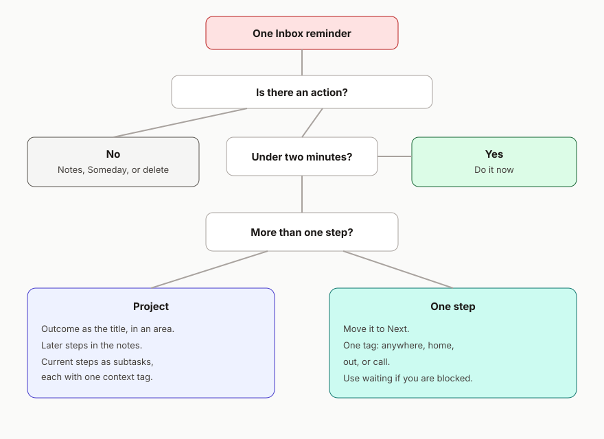

# Capture and clarify

Capture and clarify are different moments. Capture is allowed to be dumb and fast. Clarify is where you decide what the thing is. Mixing them is how tags multiply and Inbox never empties.

## Capture

Everything new goes to **Inbox**, untagged, until you have time to decide.

Ways that suit a phone:

- Say to Siri: “Add a reminder to post the parcel.” Then move it to Inbox if it landed elsewhere, and fix the default list when you next have a minute (see [setup](setup.md)).
- From Mail, Safari, Maps, or Photos, tap Share, then Reminders. Add the link so the action points back at the thing.
- Type it into the Inbox widget.
- On iOS 26, use the Reminders control in Control Centre or the Action button.

A good capture is a phrase your future self will understand. “Sam” is a bad capture. “Ask Sam whether the quote includes fitting” is a good one. You still do not choose a project, tag, or date at this moment, unless the date is the whole point (“dentist Tuesday 2:30” is a calendar event; “book the dentist” is a reminder).

If Apple Intelligence or Siri Suggestions offers a reminder from Mail, Messages, or a web page, accept it into Inbox and clarify it with everything else. Suggested reminders are captures.

## Clarify

Open Inbox when you have a little attention. After meetings, at the end of the day, or whenever it starts to nag. The aim is an empty Inbox.

Take one reminder. Ask these questions in order.

### 1. Is there an action here?

An action is a visible physical step. “Be a better parent” is not an action. “Book the optician” is.

- If it is useful information with no step, put it in Notes or Files, link it from a project if a project needs it, and delete the reminder.
- If it is an idea you might want later, move it to **Someday**. Leave it untagged.
- If it is noise, delete it.

### 2. Will it take under two minutes?

If you can finish it safely where you are, do it now and delete or complete the reminder. Two minutes is a ceiling. Filing a two-minute task into a project costs about as long as doing it.

### 3. Is the result a project?

If “done” takes more than one step, it is a project.

1. In **Projects**, in the right area section, create a reminder whose title is the outcome. “Boiler serviced”, not “boiler”.
2. In the notes, write what done looks like in a sentence or two. Add later steps as plain lines if you already know them.
3. Add **subtasks** only for steps you could take now. Give each subtask one tag: `anywhere`, `home`, `out`, or `call`.
4. Leave the parent untagged.
5. Delete the Inbox copy.

If you are waiting before any step can happen, the current subtask is tagged `waiting` instead, titled with the person’s name, and When Messaging is turned on if that person is someone you chat with.

### 4. Is it one step?

Move it to **Next**. Give it one context tag. Rewrite the title as the physical action: “Email the insurer the photos”, not “insurance”.

### 5. Does a date earn its place?

Add a date when:

- there is a real deadline, or
- you want the action to show up in Today on a particular day

Leave the date empty when the action is simply “do this when I am in that context”.

Write later steps in the project notes when you cannot usefully do them yet. Promoting a line into a subtask is how those steps enter the smart lists.

### 6. Are you choosing it for today?

Flag it if yes. Keep the flagged set small, about three. Flagging everything is the same as flagging nothing.

## A clarify sitting

Ten Inbox items is a normal sitting. You do not have to do the resulting actions in the same sitting. Finishing with an empty Inbox, and with every new project showing a tagged subtask, is the win.

If you notice you are inventing tags (“quick”, “admin”, “laptop”), stop and use one of the four contexts. Extra tags are described in [advanced](advanced.md), and they are optional on top of a context tag, after the basic loop feels easy.
