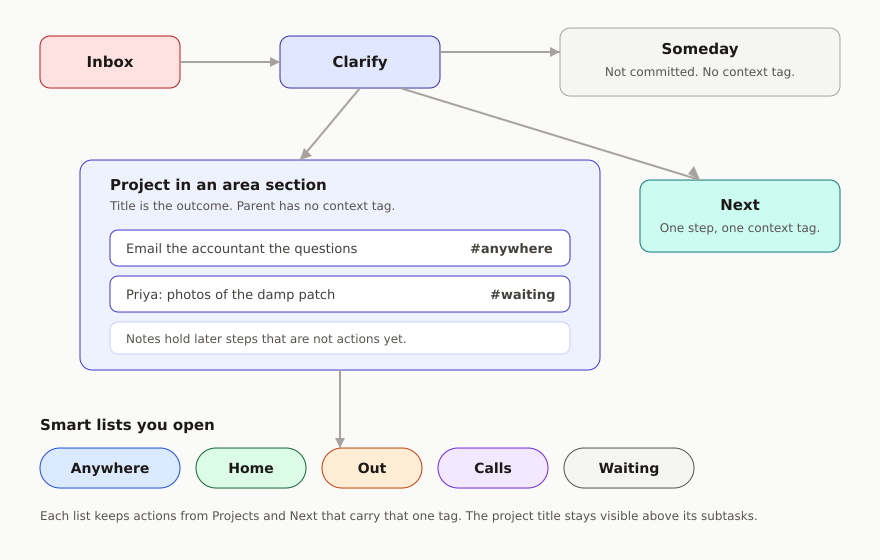

# Reminders GTD

A follow-along way to run [Getting Things Done](https://gettingthingsdone.com/) in the iPhone Reminders app.

You already have the app. This guide is the setup and the habits: which lists to create, how a project holds its actions, and which smart lists to open when you actually have a few minutes. It is written so you can set it up in an afternoon and still recognise it in a month.

This is an opinionated implementation for the **iPhone** Reminders app in **iOS 27**. The lists, sections, tags, subtasks, and smart lists it uses have been in the app since iOS 18; the tap-paths and the capture advice are written for the iOS 27 app. It leaves the Mac and web apps aside where they behave differently.

David Allen’s method is the foundation. This repository is an independent guide, not an Apple or David Allen product.

## The short version

Capture into **Inbox**. Clarify it into a small set of lists. Do your work from **smart lists**, one per context.

A project is a reminder. The things you can do on it right now are **subtasks**, and each subtask has **one context tag**. A smart list for that tag gathers those actions from every active project.

Four contexts are enough:

| Smart list | Tag | Open it when |
| --- | --- | --- |
| Anywhere | `anywhere` | You can do the action with what you already have on you |
| Home | `home` | You need to be in the house |
| Out | `out` | You need to be somewhere else |
| Calls | `call` | You need a live conversation |

`anywhere` replaces the old `@computer` context. A phone is always with you, and most “computer” work can be done in a queue, on a sofa, or at a desk. The constraint that still matters is place, or the fact that another person has to be on the line.

While you are blocked on someone else, change that action’s tag to `waiting`. It leaves the context list and shows up on a Waiting smart list, still tucked under its project.

## Read it in this order

1. [Why this is worth doing](why.md) - including how to start again after a break
2. [The model](model.md) - what each Reminders feature is for
3. [Set it up on your iPhone](setup.md) - the tap-by-tap afternoon
4. [Capture and clarify](capture-and-clarify.md)
5. [Do the work](do-the-work.md)
6. [Projects, waiting, and someday](projects.md)
7. [The weekly review](weekly-review.md)
8. [A worked week](examples.md)
9. [Optional extras](advanced.md) - only if the basic system already feels easy
10. [What Reminders will not do](limits.md)

If you only do three things: create the lists in the setup guide, put current actions as tagged subtasks under projects, and open the matching smart list when you have time.

## What you need

- An iPhone on iOS 27, signed into iCloud with Reminders turned on. Apple Intelligence extras, such as describing a reminder in a sentence, need an iPhone 15 Pro or later. The lists themselves do not.
- About an hour the first time, then a short weekly review
- No extra apps

## Licence

[CC BY 4.0](https://github.com/markheydon/reminders-gtd/blob/main/LICENSE). You can share and adapt this guide with credit.
