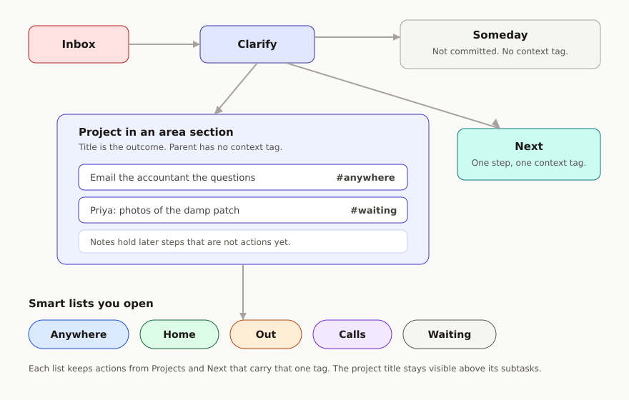

A follow-along way to run [Getting Things Done](https://gettingthingsdone.com/) in the iPhone or iPad Reminders app.

You already have the app. This guide is the setup and the habits: which lists to create, how a project holds its actions, and which smart lists to open when you actually have a few minutes. It is written so you can set it up in an afternoon and still recognise it in a month.

This is an opinionated implementation for Reminders on **iOS 27** or **iPadOS 27**. It leaves the Mac and web apps aside where they behave differently.

This guide is independent work. It is not an Apple product and it is not endorsed by David Allen or the David Allen Company.

## The short version

Capture into **Inbox**. Clarify it into a small set of lists. Do your work from **smart lists**, one per context.

A **project** is an **outcome** you are committed to. In Reminders it is a reminder on **Projects**. The next actions you can take now are **subtasks**, each with one context tag. A smart list for that tag gathers those actions from every active project.

One-off actions you can do now live on **Next Actions**, each with one context tag or `waiting` while blocked. One-off waits that are not tied to a project outcome live on **Waiting For**, tagged `waiting` the same way. Smart lists still gather by tag.

Four contexts are enough:

| Smart list | Tag | Open it when |
| --- | --- | --- |
| **Anywhere** | `anywhere` | You can do the action with what you already have on you |
| **Home** | `home` | You need to be in the house |
| **Out** | `out` | You need to be somewhere else |
| **Calls** | `call` | You need a live conversation |

\* These four are the default in this guide. Swap names only if you will still clarify to one tag per action.

`anywhere` replaces the old `@computer` context. A phone is always with you, and most “computer” work can be done in a queue, on a sofa, or at a desk. The constraint that still matters is place, or the fact that another person has to be on the line.

While you are blocked on someone else, change that action’s tag to `waiting`. It leaves the context list and shows up on the **Waiting** smart list, still tucked under its project when the wait is a subtask.

## Quick Start

1. [Set it up on your iPhone or iPad](setup.md) - the tap-by-tap afternoon
2. [Capture and clarify](capture-and-clarify.md)
3. [Do the work](do-the-work.md)

If you only do three things: create the lists in the setup guide, put current actions as tagged subtasks under projects, and open the matching smart list when you have time.

## Read the Full Guide

1. [Why this is worth doing](why.md) - what usually breaks, and how this system stays small
2. [The model](model.md) - what each Reminders feature is for
3. [Projects, waiting, and someday](projects.md)
4. [The weekly review](weekly-review.md)
5. [A worked week](examples.md)
6. [Optional extras](advanced.md) - only if the basic system already feels easy
7. [What Reminders will not do](limits.md)

## What you need

- An iPhone on iOS 27 or an iPad on iPadOS 27, signed into iCloud with Reminders turned on. Apple Intelligence extras, such as describing a reminder in a sentence, need a supported device (for example iPhone 15 Pro or later, or an iPad with Apple Intelligence). The lists themselves do not.
- About an hour the first time, then a short weekly review.
- No extra apps.

## Licence

[CC BY 4.0](https://github.com/markheydon/ios-reminders-gtd/blob/main/LICENSE). You can share and adapt this guide with credit.
