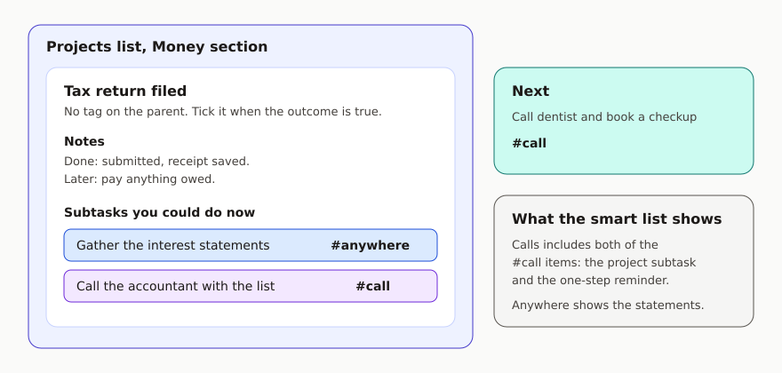
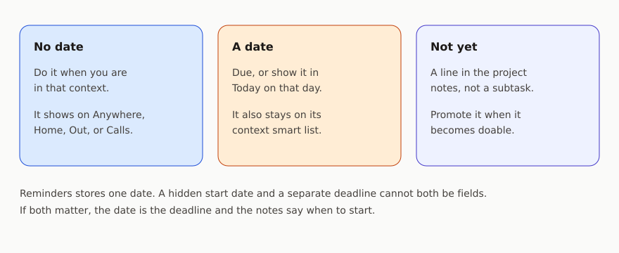

Each Reminders feature has one job. Your phone or tablet already has more knobs than GTD needs. This page is the map; [setup](setup.md) is the tapping.

## Lists

Put these in a list group called **GTD**, so shopping and shared family lists can stay outside the system.

| List | What goes in it |
| --- | --- |
| Inbox | Raw capture. Nothing here has been decided yet. |
| Projects | Outcomes you are committed to, grouped into sections by area of life. Current actions hang off each project as subtasks. |
| Next Actions | A single next action when that action is the whole commitment. Tagged the same way as project subtasks. |
| Waiting For | One-off waits that are not tied to a project outcome on **Projects**. Tagged `waiting`, same as project waits. |
| Someday | Ideas and projects you might want later, and are happy to forget until the review. |
| Weekly Review | A standing checklist. It is a tool, not a place you store work. |

Context lists are smart lists, described below. **Waiting** is a smart list too.

If you use Apple’s **Groceries** list for shopping, keep milk and errands there. “Do the grocery shop” can be an `out` action on **Projects** or **Next Actions** if you need it on your plate as a commitment.

Reference material goes in Notes or Files. A reminder can hold a link to it. The document itself is not a task.

Goals, vision, and purpose sit in **one Notes note**. The weekly review opens it. Reminders stays the place for actions.

Pure GTD ties every next action to a project. Reminders makes every action a reminder, so this guide hangs current work off project parents as **subtasks** and keeps one-off work on **Next Actions** or **Waiting For**. David Allen’s article on [linking next actions and projects](https://gettingthingsdone.com/2020/06/the-gtd-approach-to-linking-next-actions-and-projects/) explains the method; the lists above are the compromise that fits the app.

## Projects and subtasks

A project is any **outcome** that needs more than one step and that you have agreed to finish.

- The **title** is the outcome, in the done form: “Tax return filed”, “Kitchen tap fixed”.
- The **notes** are the picture of done, plus later steps you cannot take yet.
- The **subtasks** are only the **next physical action(s)** you could do now, in parallel if they do not block each other. One is normal. Three is already a lot.
- Each subtask gets **exactly one context tag** (or `waiting` while blocked).
- The project reminder itself gets **no context tag**. The parent is the outcome. The subtasks are the work. Tagging the parent as well puts a second, vaguer row into your smart lists.

> **Outcome titles and subtasks.** Name the project as if the outcome were already true. Each subtask should be a physical next action you could do now, usually starting with a verb.

When you finish a subtask and the outcome is still open, add the next subtask. Take it from the notes if you wrote the later steps down. That promotion is a five-second clarify, usually done in the weekly review, or in the moment if you know the next step.

Completing the parent reminder also completes every subtask under it. Tick the parent only when the outcome is actually done.

One-step commitments go in **Next Actions**, with a context tag, as ordinary reminders. A fake project called “Single actions” is easy to complete by accident, and completing it would clear every loose action under it. **Next Actions** avoids that trap. The context smart lists gather by tag, so those actions show up beside project subtasks.

## The four context tags

Type them in lowercase. Reminders tags are a single word. Create them by adding them to a reminder; the setup guide does this once so the smart lists can find them.

| Tag | Meaning |
| --- | --- |
| `anywhere` | You can do it with what you already have on you. This is the default. |
| `home` | You need to be at home. |
| `out` | You need to be out in the world, or at a specific other place. |
| `call` | You need a live conversation: phone or video. |

Tag the constraint. An action you could do on the sofa is `anywhere`, even if you will probably do it at a desk. An email is `anywhere`. A phone call you have to place is `call`.

Add a **location** to an `out` action when arriving or leaving a place should notify you. The location is the nudge. The tag is what makes the list.

## Smart lists are the contexts

You work from these lists. They are saved filters, so you maintain tags on the actions and the lists take care of themselves.

**Anywhere**, **Home**, **Out**, and **Calls** each match reminders that carry the one tag for that context. The filter does not name **Projects** or **Next Actions**; the tag gathers actions wherever they live.

| Smart list | Filter |
| --- | --- |
| Anywhere | Tag `anywhere` |
| Home | Tag `home` |
| Out | Tag `out` |
| Calls | Tag `call` |
| Waiting | Tag `waiting` **or** list **Waiting For** |

A smart list can show the project with its subtasks underneath. You see “Tax return filed” and, under it, the action you tagged. Tick the action. Leave the project ticked only when the outcome is done.

**Inbox**, **Someday**, and **Weekly Review** are not part of these filters. A someday idea must not appear on **Home** just because you were standing in the kitchen when you thought of it.

Built-in lists you keep visible:

- **Today** - dated items whose day has arrived, plus overdue ones
- **Scheduled** - anything with a date, so you can see deadlines coming
- **Flagged** - the few actions you have chosen as current focus (a few at a time); a flag stays until you finish the action or clear it

## Waiting

`waiting` is a status tag. While an action is blocked on someone else:

1. Change its tag from the context to `waiting`. One tag, still, so it drops out of **Home**, **Out**, **Calls**, and **Anywhere**.
2. Title it so the person is obvious: “Sam: signed contract”.
3. Turn on **When Messaging** for that person if a nudge in Messages would help.

Project waits stay subtasks on **Projects**. One-off waits can live on **Waiting For** with the same tag. The **Waiting** smart list shows both.

When the thing arrives, put a real context tag back on it, or add the true next action and complete the waiting one.

## Dates, flags, and priority

Reminders has one date field. This system uses it like this:

- **No date** means “do it when I am in that context”.
- **A date** means “this is due, or I want it in **Today** on that day”. It still appears in its context smart list before then, so you can do it early. **Today** and **Scheduled** are what stop a deadline from depending on your memory.
- Steps you must not start yet stay in the **project notes**. They are not subtasks, so they stay off the smart lists until you promote them. That is deferral.

There is no separate start date that hides an action until Thursday and also tracks a Friday deadline. If both matter, keep the action visible with the deadline as the date, and write “start Thursday” in the notes. [Limits](limits.md) is frank about this.

**Flag** means “I am choosing this as current focus for today”. Three flags is plenty. Clear them when the day is done, or during the review if they have gone stale.

**Priority** stays unset. Use High only when missing the action has a real consequence you might otherwise skim past. Medium and Low are left unused so priority does not become a second tagging system.

## Sections

Sections are for **areas** on the **Projects** list: the parts of life that have no end date. A starter set:

- Work
- Home
- Money
- Health
- People

Rename them until they sound like your life. Four to seven is enough. Delete empty ones. Areas are how you scan projects in the review. They are not contexts, and actions do not get an area tag as well as a context tag. The section of the parent project is the area.

## What you open

| Moment | Open |
| --- | --- |
| Something just occurred to you | **Inbox**, via Siri or the share sheet. Do not tag it yet. |
| You are about to do something | The smart list for where you are. **Anywhere** if place does not matter. |
| You need a short list for today | Flag up to three actions, then use **Flagged** or **Today**. |
| You are planning the week | **Projects**, then the weekly review checklist. |
